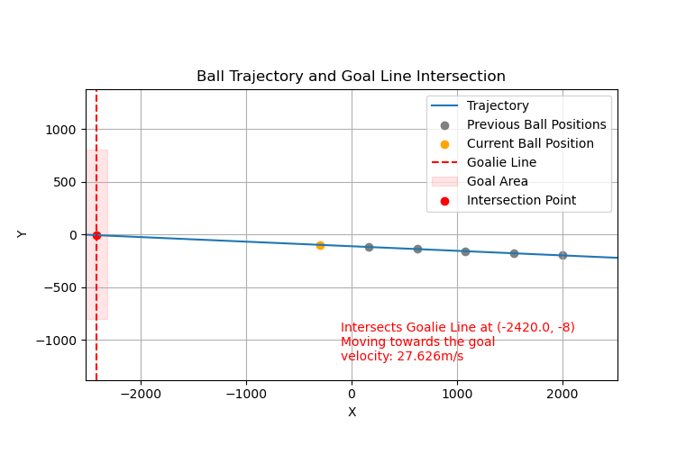
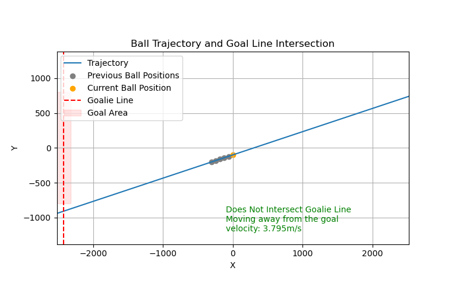

# Low level skills
This is a set of low level skills and utility scripts that are not yet integrated in the code base.

## ball_trajectory.py
This script estimates the trajectory of a moving ball using linear regression based on the last observed ball positions. Furthermore, it determines the direction the ball is moving (based on its x coordinate), the velocity the ball is moving at (based on the traveled distance between two consecutive frames) and the whether or not the ball is going into the goal following its estimated trajectory. If the ball is estimated to go into the goal the script furthermore returns the position at which the ball is going into the goal so the goalie can block it.

This is useful for multiple scenarios. First of all when an adversary player has the ball and kicks it towards our goal we can estimate where the ball is going to go into the goal and we can send this position to the goalie so the goalie can move to that position and block the ball from going into the goal.

Whenever a ball is moving either because it was passed to a robot or when an adversary player has kicked it we want to intersect its trajectory. For this it is not only important to know where the ball is at the current moment, but also where it is going to be at a later time point. Because then we can send a robot to the position to the expected position of the ball at the time it reaches the ball. 

Example of an estimated ball trajectory where the ball is going into the goal:

Example of an estimated ball trajectory where the ball is not going into the goal:

Note: In the script are a number of parameters that might have to be changed such as the goal width etc.

## coord_trans.py
This script implement the transformation of the coordinate systems (local robot coordinate system vs. field coordinate system).

Check out the explanation of the coordinate system transformation in the [wiki](https://github.com/WSU-TurtleRabbit/WSU-TurtleRabbit.github.io/wiki/SSL-Vision#coordinate-system-transformation).

## turn_to_ball.py
In order to kick the ball or receive a pass the robots kicker must point into the direction of the ball. This script tries to implement this. Based on the current ball position in the robot coordinate system (e.g. (10mm, -300mm)) the script sets an agular velocity. The goal is that the robot should turn in such a way that its kicker is pointing in the direction of the ball. In order to avoid jitter because the robot would constantly try to fix its orientiation when it is not absolutely perfect I have added an epsilon. This defines the offset from the perfect orientation that is considered ok. This epsilon is parameter that can be adapted if necessary.
